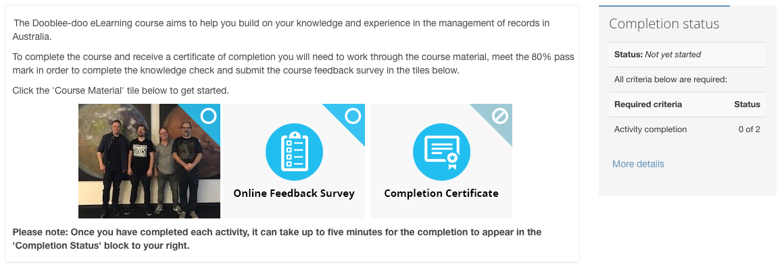

# Activity Completion Image

This filter lets you add a completion status icon to hyperlinks that contain an image. This can be useful if you use hidden activities and use hyperlinks to get to those activities. The result can be a nicely formatted list of images that users can click on, but can also see the completion status of an activity as an icon.

Currently it has three possible icons - not yet completed, not available (for activites you can't get to because of a condition), and completed. These icons are hard coded at this time, but use font-awesome and could potentially be changed using `::before` class content hacks.

The filter modifies the HTML of the hyperlink to contain an extra span and icon, with various classnames applied to the objects in order for them to be styled. No styling is applied by default, but it is expected that a user could add custom styling to their theme's CSS.

## Installation

Drop this folder into your moodle `filter` folder and install as normal.

## Example



A course introduction with hyperlinked hidden activites, alongside the standard completion status block.

And the styles shown here (added to the theme custom css):

```css
a.completion-info {
	position: relative;
	display: inline-block;
}
a.completion-info > span:before {
 	content: '';
    border: 45px solid transparent;
    border-bottom-color: rgba(8, 189, 242, 0.9);
    transform: rotate(45deg);
    position: absolute;
    top: -45px;
    right: -45px;
    z-index: 1;
}
a.completion-info > span.state-completed:before {
	border-bottom-color: rgba(33, 242, 8, 0.9);
}
a.completion-info > span.state-unavailable:before {
	border-bottom-color: rgba(67, 156, 182, 0.5);
}
a.completion-info > span {
	display: block;
	position: absolute;
	top: 0;
	right: 0;
	z-index: 2;
	width: 32px;
	height: 32px;
	padding: 4px 4px 0 0;
}
a.completion-info > span > i {
	z-index: 3;
	position: relative;
	color: white;
	font-size: 2em;
}
a.completion-info > img {
	margin: 0;
}
```

## Example usage

On your course, add activities to the section. Hide the activities (and make them available; which in turn requires the `allow stealth activities` option in *Advanced features* in Moodle 3.5). Copy the hyperlink of each activity and put it into the editor. Inside that hyperlink, place an image. Each link might have html that is like this:

```html
<a href="http://your-moodle-url/mod/page/view.php?id=514"></a>
```

 Next, ensure that the filter is ON for the course (it is on-but-disabled by default). When the course renders, it will find these hyperlinks links, look up the completion status of the activity in the context of the current user, and append extra html before they render. The resulting html will be something like this:

```html
<a href="http://your-moodle-url/mod/page/view.php?id=514" data-cmid="514" class="completion-info"><span title="Not yet completed" class="state-incomplete"><i class="fa fa-circle-o"></i></span></a>
```

## Licence

http://www.gnu.org/copyleft/gpl.html GNU GPL v3 or later